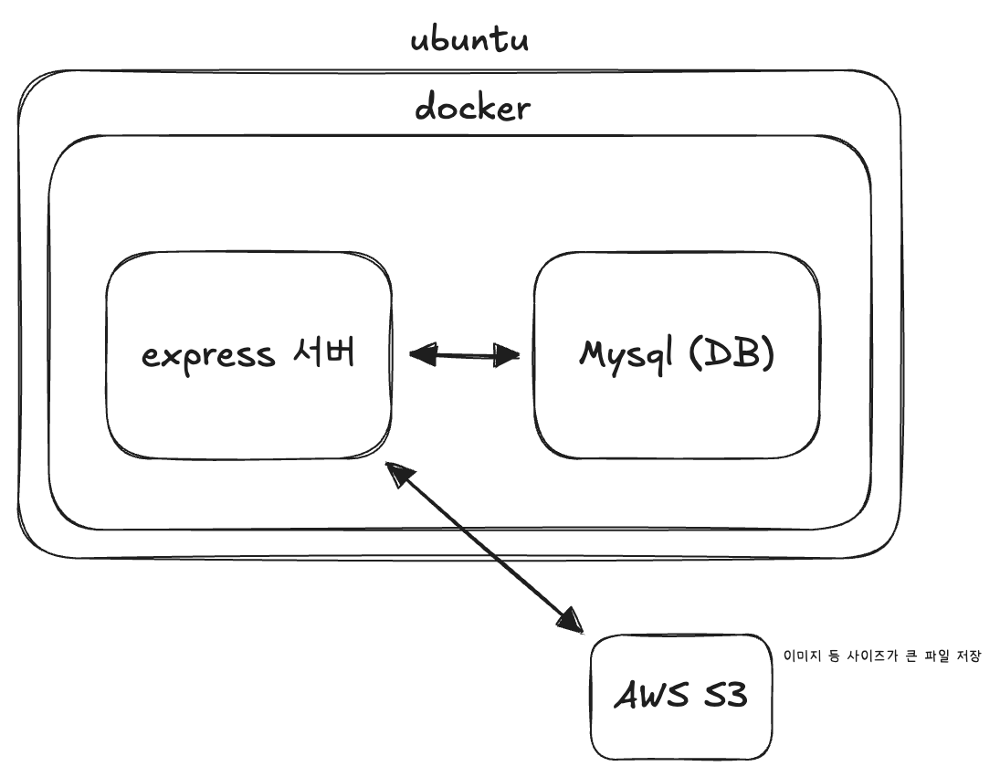
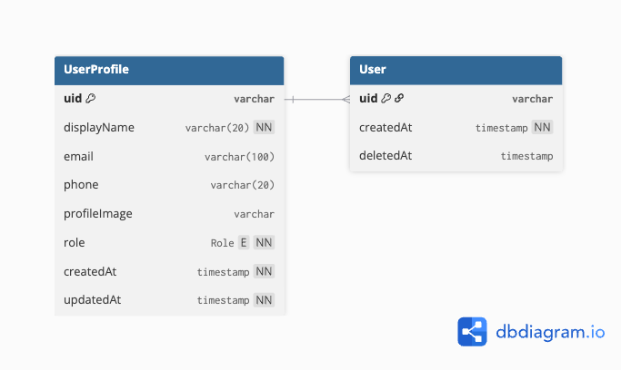
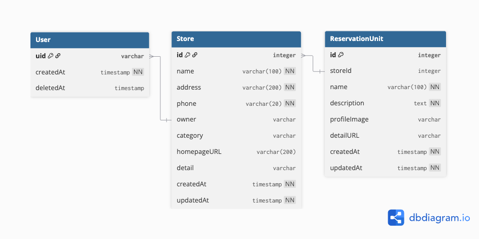
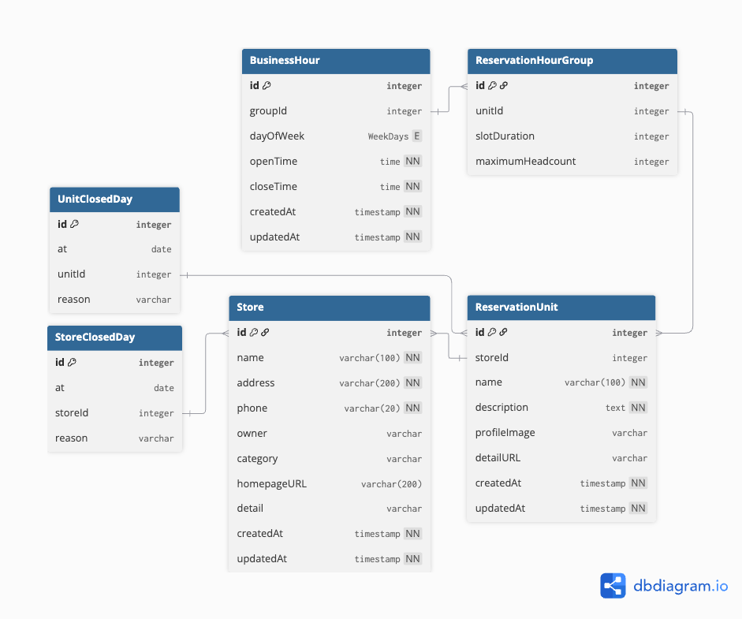
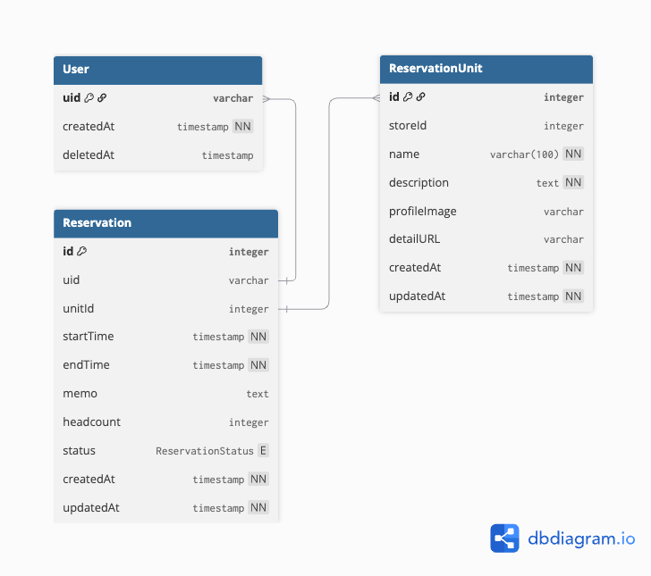
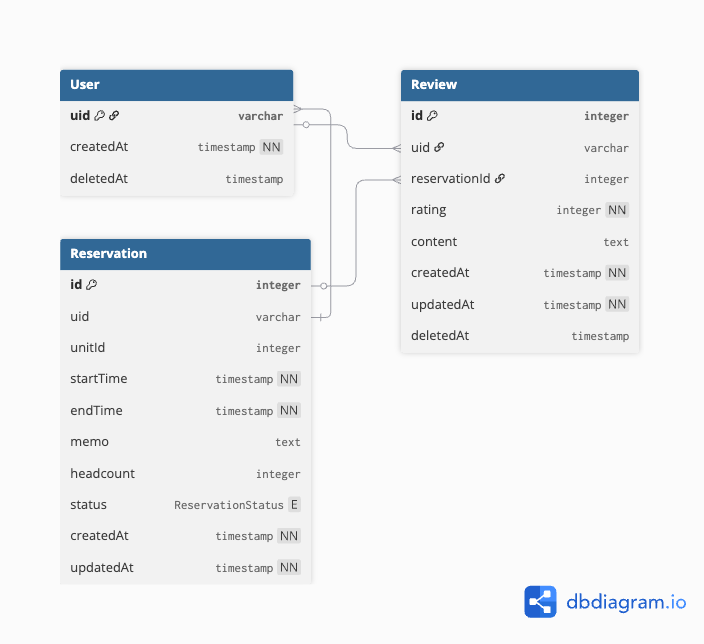
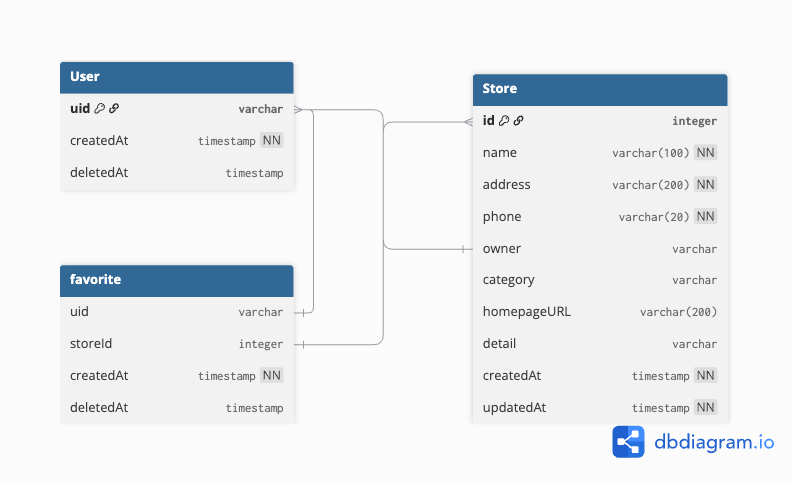

# reservation-backend
25-2 웹서비스설계 최종 프로젝트

## 1. 프로젝트 소개
### 📔 서비스 개요
>본 프로젝트는 25-2 웹서비스설계의 최종 프로젝트로, 네이버 예약과 유사한 구조를 가지는 가게 예약 서비스 백엔드 API 를 구현하는 것을 목표로 한다.  
   
사용자는 다양한 가게 정보를 확인하고, 원하는 시간에 예약할 수 있으며, 점주는 자신의 가게 정보를 등록, 관리하고 예약 현황을 실시간으로 확인할 수 있다.

### 📔 주요 기능 요약
1. 로그인 / 회원가입
2. 내 정보
3. 가게 등록 / 수정 / 삭제
4. 예약 / 예약 취소 / 예약 확인
5. 가게 검색
6. 가게 리뷰
7. 가게 즐겨찾기

### 📔 기술 스택 소개
- 백엔드 서버, DB: JEduTools ubuntu 사용
- DB 연동: aws s3 로 이미지 저장
- Node.js + express 사용
- ORM: `Sequelize`

## 2. 시스템 아키텍처
### 📕 전체 구조도
<p align="center">
    
</p>

### 📕 백엔드 레이어 구조

### 📕 데이터 흐름 설명


## 3. ERD
> `dbdiagram.io` 링크: [ERD 설계 링크](https://dbdiagram.io/d/ReservationBackend-692f14add6676488ba495be1)

<p align="center">
    
</p>

<details>
<summary>ERD 코드</summary>
<div markdown="1">

```sql
ENUM WeekDays {
  SUN
  MON
  TUE
  WED
  THU
  FRI
  SAT
}

ENUM Role {
  CUSTOMER
  OWNER
  ADMIN
}

Enum ReservationStatus {
  PENDING
  CONFIRMED
  CANCELED
  COMPLETED
}

Table User {
  uid varchar [pk]

  createdAt timestamp [not null, default: "now()"]
  deletedAt timestamp [default: null]
}

Table UserProfile {
  uid varchar [pk, ref: < User.uid]
  displayName varchar(20) [unique, not null]
  email varchar(100) [unique]
  phone varchar(20) [unique]
  profileImage varchar [note: "s3 경로"]
  role Role [not null, default: Role.CUSTOMER, note: "[CUSTOMER, OWNER, ADMIN]"]

  createdAt timestamp [not null, default: "now()"]
  updatedAt timestamp [not null, default: "now()"]
}

Table Store {
  id integer [pk, increment]
  name varchar(100) [not null]
  address varchar(200) [not null]
  phone varchar(20) [not null]
  owner varchar [ref: < User.uid]
  category varchar [note: "[숙소, 식당, 스토어] 중 택 1 추후 추가 가능"]
  homepageURL varchar(200) [default: null]
  detail varchar [note: "상세 페이지"]

  createdAt timestamp [not null, default: "now()"]
  updatedAt timestamp [not null, default: "now()"]
}

Table ReservationHourGroup {
  id integer [pk, increment]
  unitId integer [ref: < ReservationUnit.id, unique]
  slotDuration integer [default: 30, note: "min 단위의 예약 단위 시간"]
  maximumHeadcount integer [default: 1, note: "최대 예약 가능 수"]
}

Table BusinessHour {
  id integer [pk, increment]
  groupId integer [ref: < ReservationHourGroup.id]
  dayOfWeek WeekDays [note: "요일"]
  openTime time [not null]
  closeTime time [not null]

  createdAt timestamp [not null, default: "now()"]
  updatedAt timestamp [not null, default: "now()"]
}

Table StoreClosedDay {
  id integer [pk]
  at date
  storeId integer [ref: < Store.id]
  reason varchar
}

Table UnitClosedDay {
  id integer [pk]
  at date
  unitId integer [ref: < ReservationUnit.id]
  reason varchar
}

Table ReservationUnit {
  id integer [pk, increment]
  storeId integer [ref: < Store.id]
  name varchar(100) [not null]
  description text [not null]
  profileImage varchar [note: "s3 혹은 이미지의 경로"]
  detailURL varchar [default: null, note: "sns 경로 혹은 상세 페이지가 있다면 그 경로"]

  createdAt timestamp [not null, default: "now()"]
  updatedAt timestamp [not null, default: "now()"]
}

Table Reservation {
  id integer [pk]
  uid varchar [ref: < User.uid]
  unitId integer [ref: < ReservationUnit.id]
  startTime timestamp [not null]
  endTime timestamp [not null]
  memo text [note: "예약 세부사항"]
  headcount integer [default: 1]
  status ReservationStatus [note: "예약확인중, 예약됨, 취소됨, 완료됨"]

  createdAt timestamp [not null, default: "now()"]
  updatedAt timestamp [not null, default: "now()"]
}

Table Review {
  id integer [pk, increment]
  uid varchar [ref: > User.uid]
  reservationId integer [ref: > Reservation.id]
  rating integer [not null, note: "0 ~ 10 까지의 점수"]
  content text

  createdAt timestamp [not null, default: "now()"]
  updatedAt timestamp [not null, default: "now()"]
  deletedAt timestamp [default: null, note: "소프트 딜리트 시 사용"]
}

Table favorite {
  uid varchar [ref: < User.uid]
  storeId integer [ref: < Store.id]

  Indexes {
    (uid, storeId) [unique]
  }

  createdAt timestamp [not null, default: "now()"]
  deletedAt timestamp [default: null, note: "소프트 딜리트 시 시간이 설정됨"]
}
```
</div>
</details>

### 📘 주요 테이블 설명
<details>
<summary>유저 관리</summary>
<div markdown="1">

- 유저 관련 ERD
    <p align="center">
        
    </p>

  - User Table
    - 소셜 로그인 (네이버, 카카오) 과 firebase 를 통한 로그인을 연동하기 위한 테이블
  - UserProfile Table
    - 유저의 필요한 정보 (닉네임, 프로필 사진, 전화번호 등) 를 저장하는 테이블

</div>
</details>

<details>
<summary>가게 정보</summary>
<div markdown="1">

- 기본 가게 정보
    <p align="center">
        
    </p>

  - Store Table
    - 가게 정보를 저장하는 테이블
  - ReservationUnit
    - 예약 단위 정보를 저장하는 테이블 (예시: 미용실의 디자이너, 숙박업소의 호실 등)


- 운영시간 정보
    <p align="center">
        
    </p>

  - BusinessHour Table
    - 운영 시간 정보를 요일별로 저장
  - BusinessHourGroup Table
    - BusinessHour 의 요일 정보들의 묶음, ReservationUnit 과 1:1로 연결됨
  - UnitCloseDay / StoreCloseDay
    - 가게 / 예약단위 의 휴무일을 지정할 수 있도록 하는 테이블
    - BusinessHourGroup 에서 평상시 운영 시간을 설정하고, 여기서는 부득이한 휴무일을 지정하도록 한다.

</div>
</details>

<details>
<summary>예약</summary>
<div markdown="1">

- 예약 관련 ERD
    <p align="center">
        
    </p>

  - User Table
    - 유저 관리 상세 참조
  - ReservationUnit Table
    - 가게 정보 상세 참조
  - Reservation Table
    - 예약 관리 테이블
    - 시작 시간, 종료 시간을 지정하여 저장함
    - memo 속성에서 예약 상세 정보를 저장할 수 있다

</div>
</details>

<details>
<summary>리뷰</summary>
<div markdown="1">

- 리뷰 관련 테이블
    <p align="center">
        
    </p>

  - User Table
    - 유저 관리 상세 참조
  - Reservation Table
    - 예약 관련 상세 참조
  - Review
    - 리뷰 관리하는 테이블
    - 별점과 본문을 작성할 수 있다.

</div>
</details>

<details>
<summary>관심 가게</summary>
<div markdown="1">

- 관심 가게 관련 테이블
    <p align="center">
        
    </p>
  - User Table
    - 유저 관련 상세 참조
  - Store Table
    - 가게 정보 관련 상세 참조
  - Favorite Table
    - 가게 좋아요 정보
    - 유저는 자주 예약하거나 가고싶은 가게를 저장할 수 있다.

</div>
</details>


<!-- ### 📘 테이블 간 관계 설명 -->


## 4. API 설계
### 📙 REST API 규칙

### 📙 엔드포인트 구조

### 주요 API 목록
- 사용자
- 가게
- 예약
- 리뷰
- 관리자

## 5. 디렉토리 구조
- 폴더 구조
- 각 폴더의 역할 설명

## 6. 인증 및 권한
- JWT 구조
- Access Token/Refresh Token
- 사용자 권한 구분

## 7. 예약 시스템 설계
- 예약 시스템
- 예약 상태 흐름  
    (신청 -> 승인 -> 방문 -> 완료)

## 8. 비즈니스 로직 설계
- 가계별 예약 설정
- 예약 취소 흐름
- 리뷰 작성 조건

## 9. 예외 처리 전략
- 공통 에러 처리 구조
- HTTP 상태 코드 규칙
- Custom Error 객체 구조

## 10. 환경 변수 구성
- DB 환경 변수
- JWT 환경 변수
- 서버 설정

## 11. 로깅 및 모니터링
- Winston / Pino 등 로깅 라이브러리
- 요청 / 응답 로깅 규칙
- 에러 로그 저장 위치

## 12. 배포
- 서버 실행 방법
- Docker 기반 배포

## 13. 테스트 전략
- 유닛 테스트
- 통합 테스트

## 14. 실행 방법
- 설치 및 실행 명령
- API 테스트 가이드 (Postman)

## 15. 추후 개선사항